# 作业

# 完成情况

## （1）罚抄作业

## （2）数学卷子

(1) **对 ** B

**有理数**：*整数和分数统称为有理数*  **1 2/1 等**

**无理数**：*无限不循环小数*

(2)对 B

(3)对 B

(4) ❌  选C  

同位角相等 两直线平行

内错角相等 两直线平行

**同旁内角互补，两直线平行**   ∠3 和∠4 互补 加起来等于 180°  正确答案选C

(5)对 C

(6) C

相等的角不一定是对顶角 1选项错

2选项对 

同旁内角不一定互补 3选项错

互为领补角的的两角的角平分线互相垂直 4选项正确

**所以最后对的有两个** 选**C**

(7)对

(8) 错  选**A**

(9) 错  **B**

-1^2017 =-1

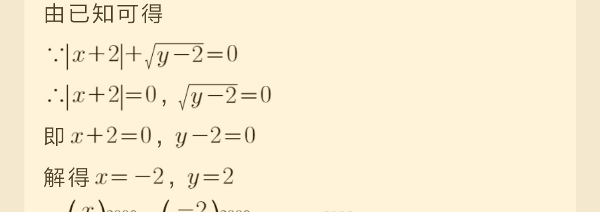

(10)错  选**A**

----

(11)没写  **8**

(12)对

(13) 对 133°

(14)错  **a-2c+b****

(15) 对

(16)

1. 错3-6+4 =1
2. 错3-4-1-8=-10
3. 错-3-0-0.5+0.5+0.25=2¾
4. -8 * 4-4 * ¼+2根号6=-32-1+6=-27+2根号6

(17)对

(18) 错

1. 7:11 aoc=70度 aod=110度 70/2=35 + 110=145度

2. 55+

   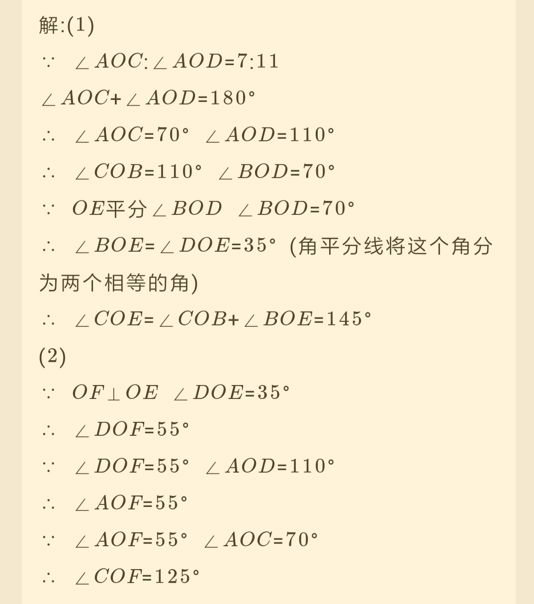

(19)

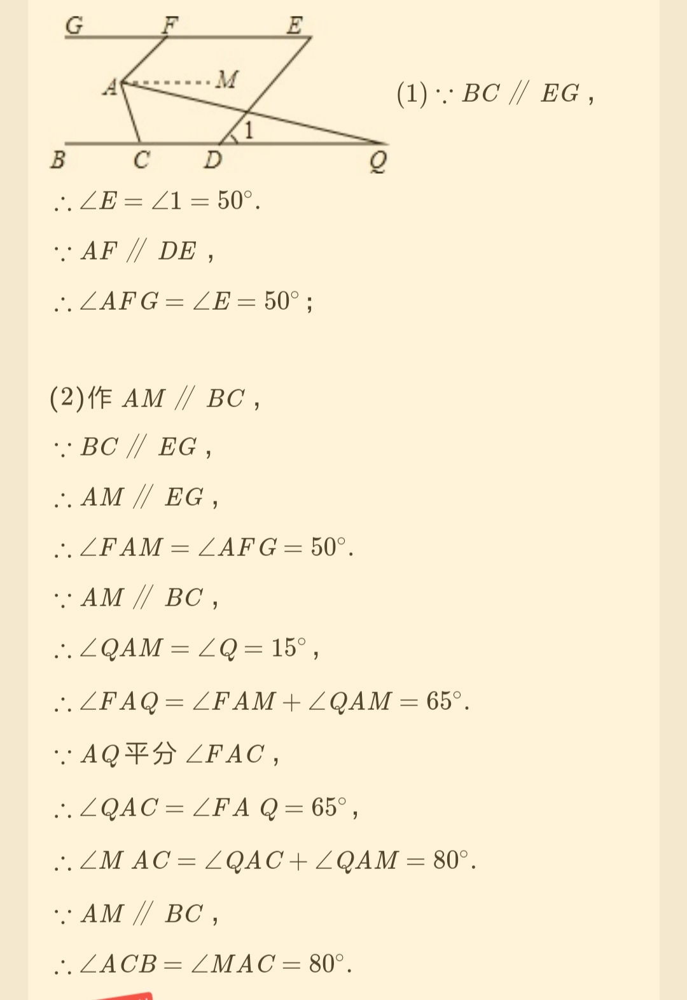

(20)

对

对

对

对

对

(21)

对

(22)

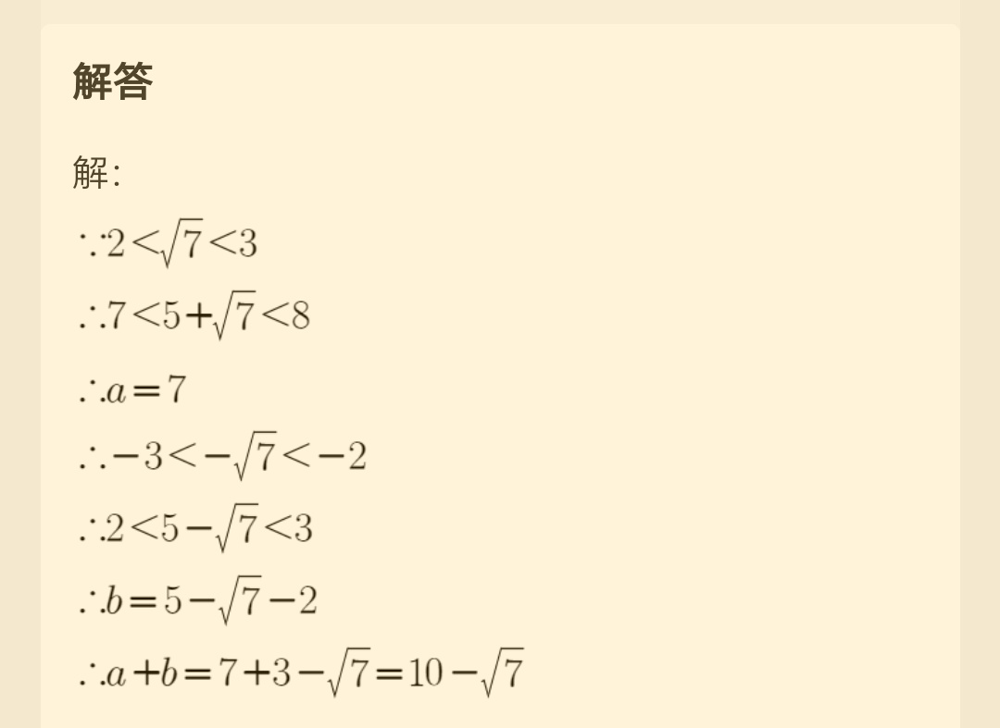

(22)

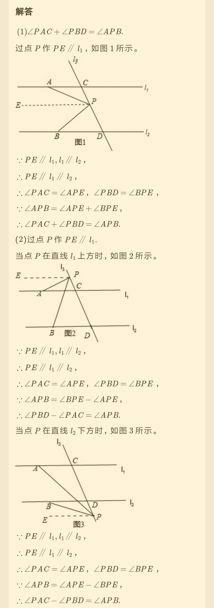

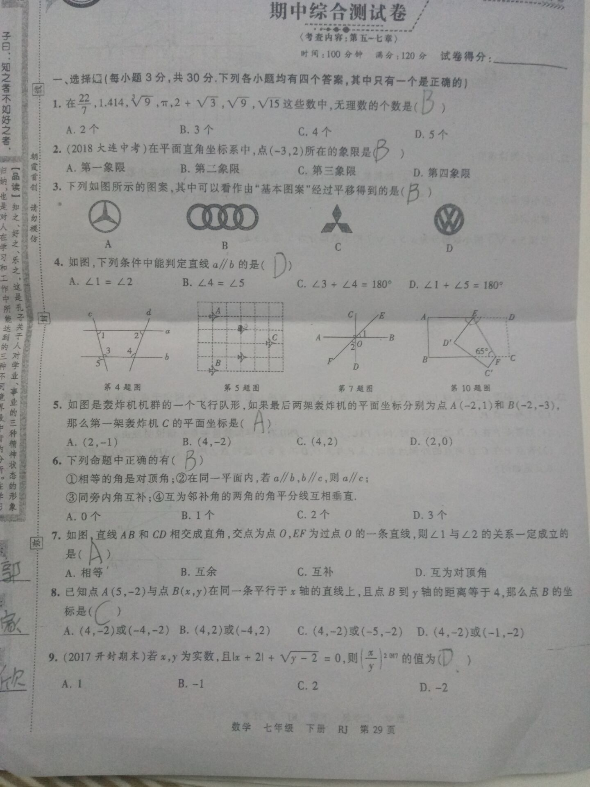

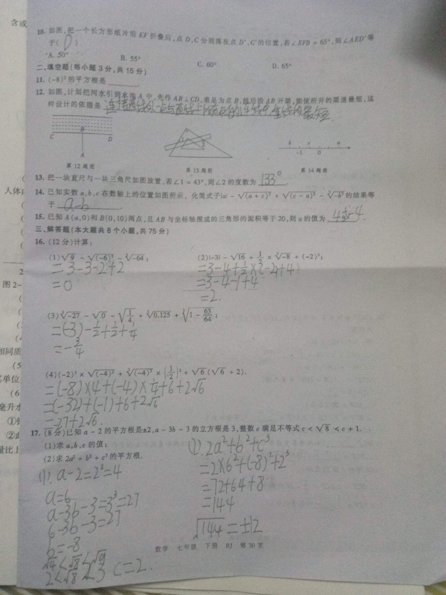

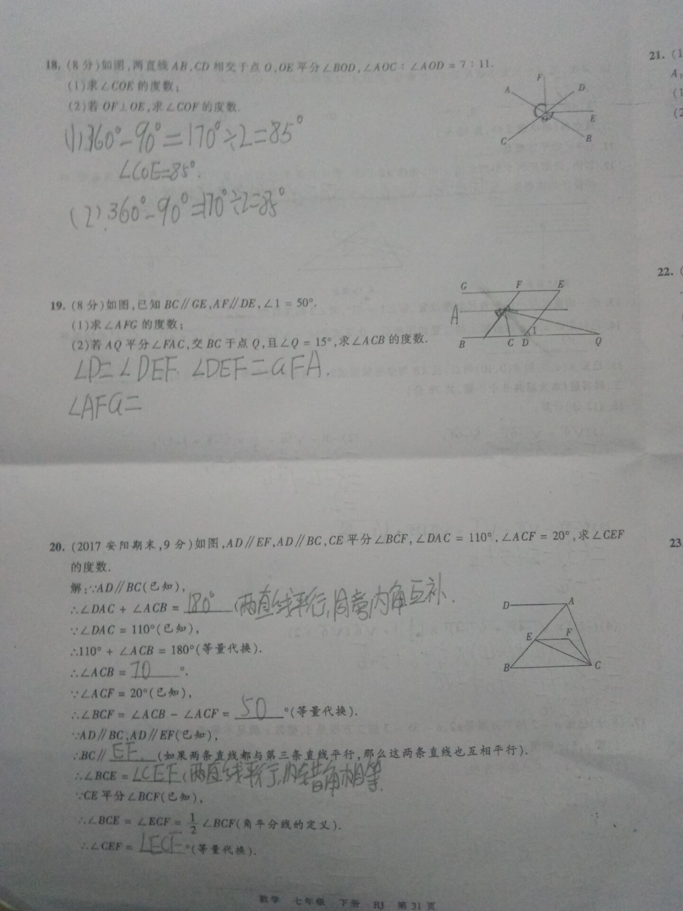

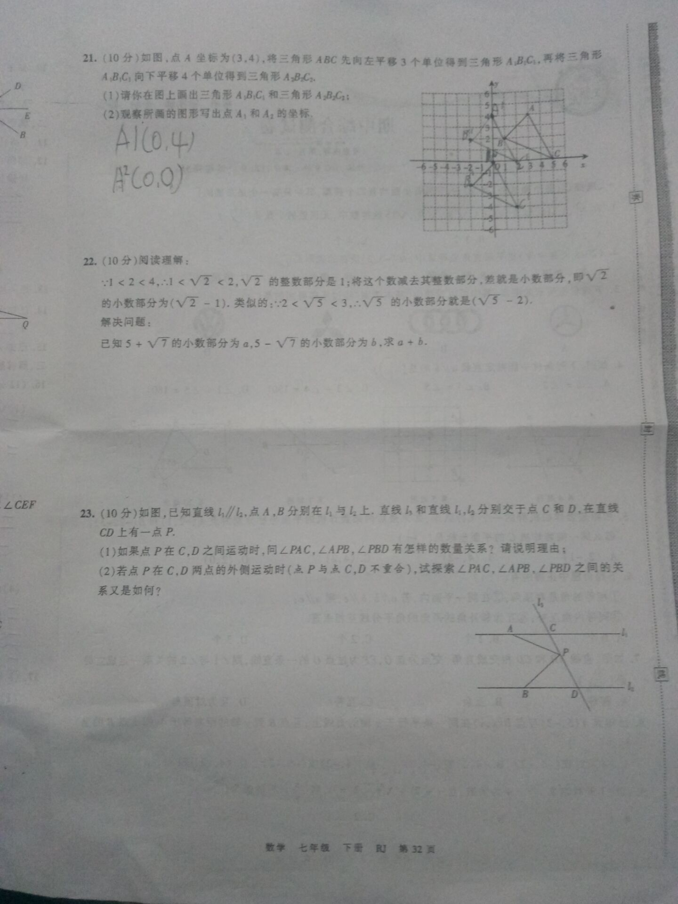

## （3）生物作业

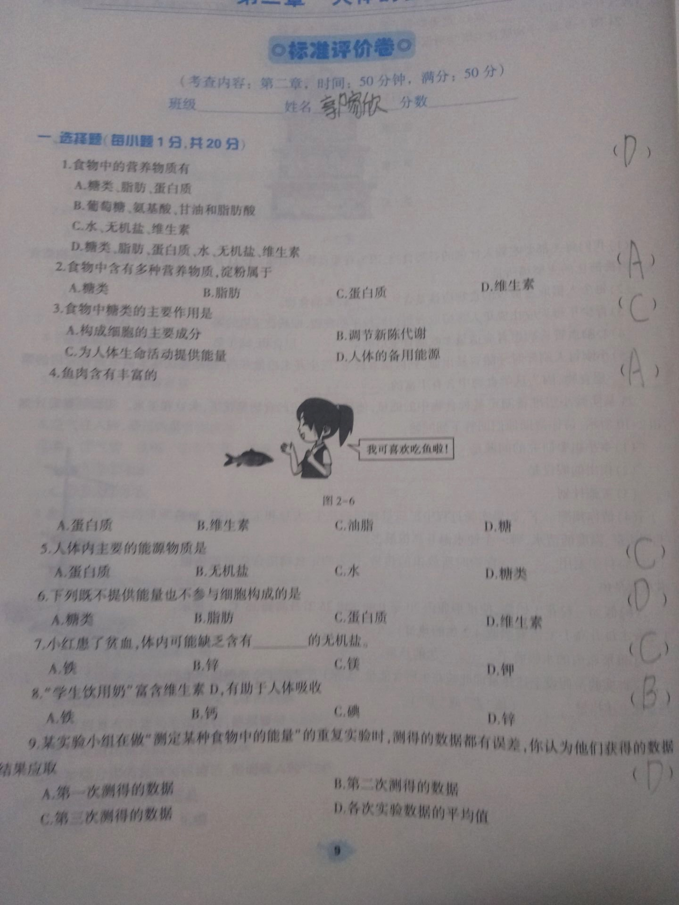

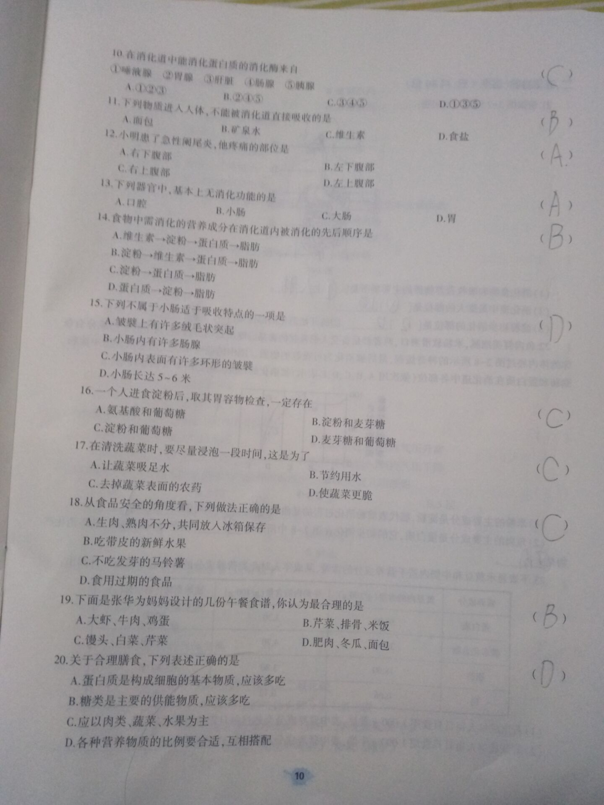

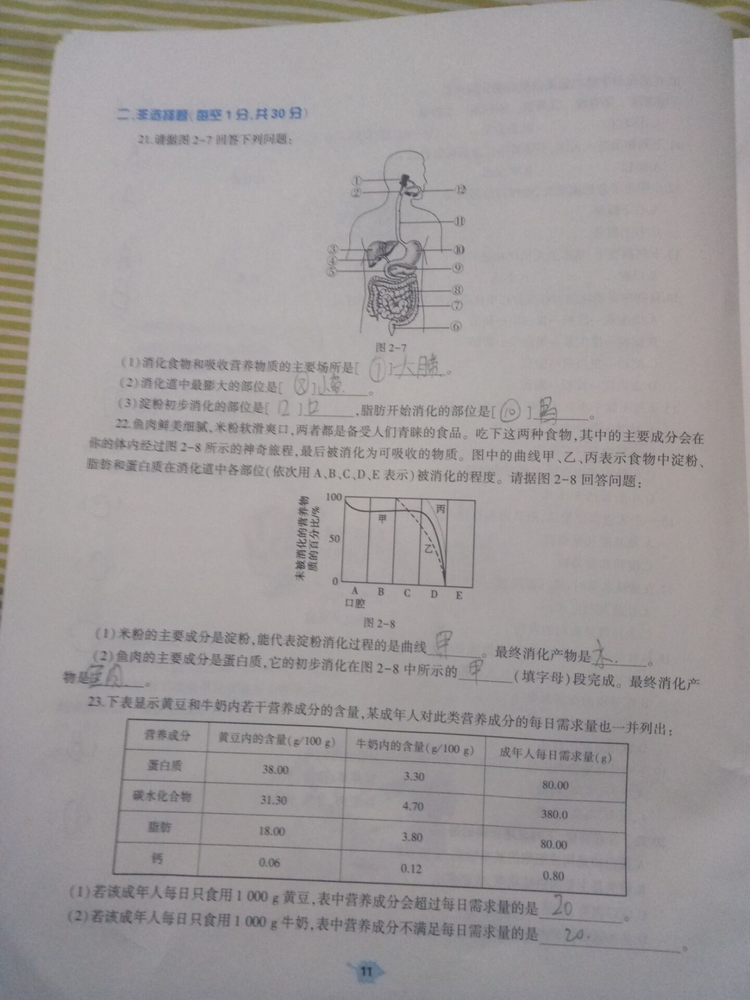

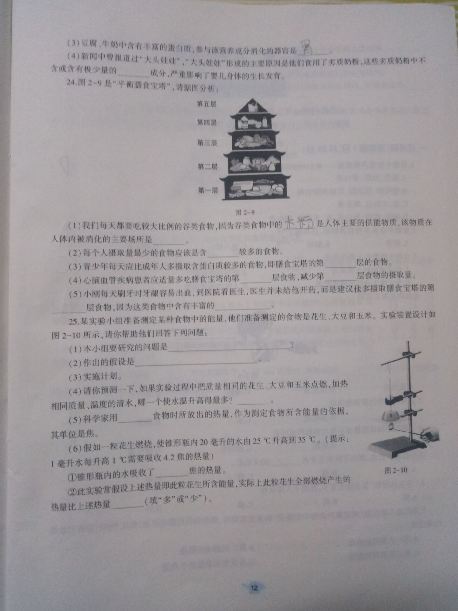

## （4）罚抄错题

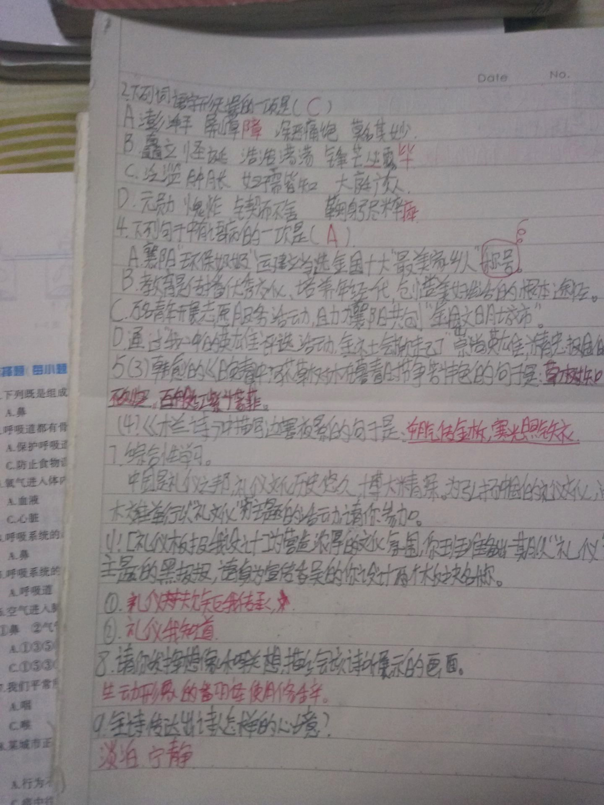

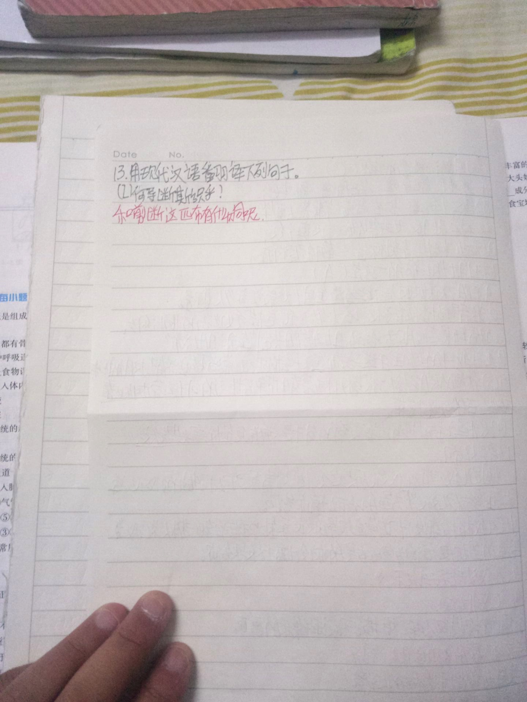

